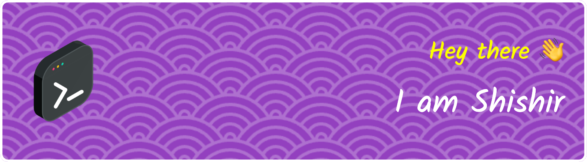

<table width="100%">
  <tr>
    <td>
      
    </td>
    <td>
      
    </td>
    <td>
      
    </td>
  </tr>
</table>

## 🧔 About me

- 🎓 **M.Tech in Artificial Intelligence** at **IISc Bangalore**
- 🔬 Researcher at **Spectrum Lab, IISc**, focusing on:
  - Object Detection  
  - Optical Character Recognition (OCR)  
  - License Plate Detection & Recognition
- 🧠 Experienced in diverse **Computer Vision** tasks:
  - Image Classification  
  - Image Segmentation  
  - Object Tracking  
  - Image Captioning  
  - Visual Question Answering (VQA)
- 🛠️ Skilled in:
  - Image Processing Techniques  
  - Transformer Architectures  
  - AI Accelerators & Optimization Algorithms
- 🚀 Passionate about contributing to cutting-edge **AI/ML solutions**
- 🤝 Open to collaborations in **Computer Vision** and **AI research**

## 🧑‍💻 Skills

## 📫 How to reach me
 